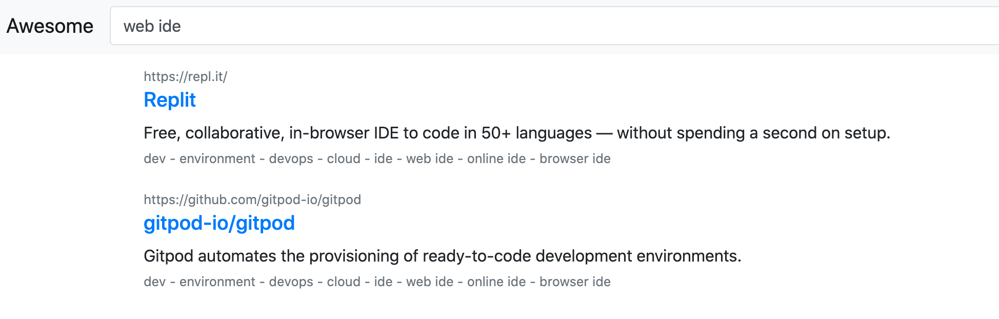

# tadeugr/awesome



An awesome list with a built-in localhost search engine. Think of a "personal Google" with a tailored indexed dataset.

I know there are many better awesome lists out there, although most often it is hard to browse the content because Markdown Table of Contents is not intuitive and to use `Ctrl + F` to find keywords is not always the best option.

Now you can create your own awesome list and to have a powerful search engine to browse the content.

# Get started

## Requirements

- Docker;

- Docker Compose.

## Start

Clone this repo and `cd` to its directory.

```
git clone https://github.com/tadeugr/awesome.git
cd awesome
```

Build and run the stack.

```
make up
```

The script will run `docker-compose up -d`, then read `awesome.yaml` and populate MeiliSearch

Access: http://localhost:8080/

## Stop

To stop all docker containers, run.

```
make down
```

## Delete

To delete all docker containers, run.

```
make rm
```

# Contributors are welcome

Let's create together the most awesome awesome list.

# Debug

## From inside the proxy container

Allocate a TTY.

```
docker-compose exec proxy /bin/sh
```

Use MeiliSearch container to test connectivity.

```
curl -X GET 'http://172.27.0.1:7700/indexes/awesome/search' -H "X-Meili-API-Key: masterKey" -i
```

Use MeiliSearch container through nginx proxy to test connectivity.

```
curl -X GET 'http://localhost:80/search/indexes/awesome/search' -H "X-Meili-API-Key: masterKey" -i
```

## From host workstation

```
curl -X GET 'http://localhost:8080/search/indexes/awesome/search' -H "X-Meili-API-Key: masterKey" -i
```